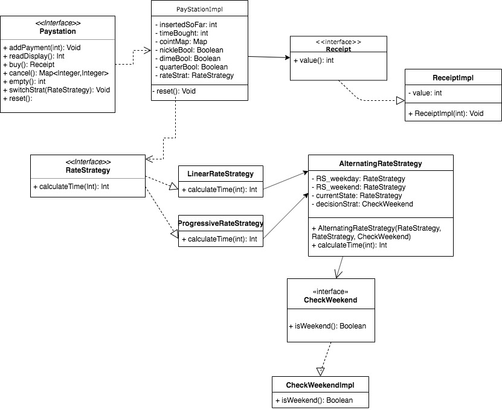

# paystationmain-05-panneer-kalouche-savceboys 

## Requirements
The lab required the developers to continue working on the previous paystation machine which is a machine that allows a user to do many functions. Some of the functions the user must do include being able to insert coins, return coins, buy a parking pass and change rate strategy in case an administrator needs to change the rate of parking. The developers needed to make sure that the user interface was usable and able to let the user do actions they wanted until they successfully bought a parking pass or exited the interface intentionally. The developers were able to successfully implement a working paystation with full functionality. The model we used to implement the rate strategy was a compositional model. We took the requirements and developed algorithms in code to return the correct values while we wired the main interface to navigate through the users preferences in order to use the correct algorithm. We have provided our UML Model below.
## Team Work
**Shakthi Panneer**  
Shakthi was in charge of making the skeleton and overall user interface. He created an elegant and fluid menu that allows the user to get the tasks they need done as well as making sure the interface returns to the main menu if the user needs to. As a result, the interface is able to let the user use a complicated series of actions while using the correct pay rates simultaneously.   
**Kamelya Kalouche**  
Kamelya created the algorithms to ensure that the paystation was properly charging and calculating the time and fare for the customer. She intelligently weaved the algorithms together so that they seamlessly returned the correct values as well as afjusted numbers if the input paramaters appeared to be different. She had perfectly implemented all three rates for the customers of the different towns. 
## Testing
The testing the developers did was manual testing. This method of testing was chosen because the interface designed made it easy to use the machine and release actual numbers. Comparing it to hand calculations made it very easy as we were able to implement corrections to the final paystation immediately. There were no challenging problems as we primarily used the tests to keep checking if the right values were returned and simply adjusted if otherwise. Shakthi tested the numbers in the interface while Kamelya kept adjusting the strategies until the pay rate came out correctly. 

